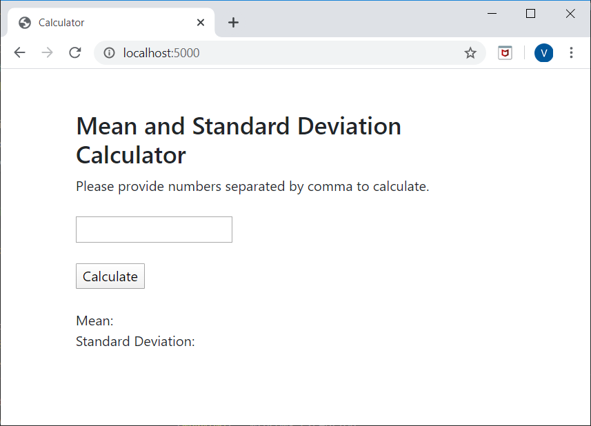
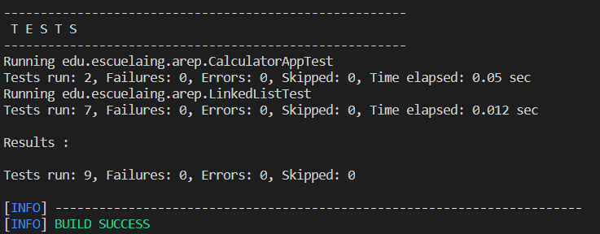

# AREP-SparkWebApp

This web application allows you to calculate the mean and standard deviation of a set of data that is passed through a web page using Spark micro framework. 
The project implements my own implementation of a linked list.

## Getting Started

 In order to use this project, first clone this repository or download the project.

Then access the address where the project is located and execute the following commands

```
mvn compile
mvn package
mvn install
```
In order to generate the documentation of the project use the command 

```
mvn javadoc:javadoc
```
This command will generate the documentation in the folder 
```
 /target/site/apidocs/
 ```

To run the application in the heroku local web in windows, change the Profcile file to:

```
web: java -cp target\classes;target\dependency\* edu.escuelaing.arep.SparkWebApp
```
and execute the following command on your console:

```
heroku local web
```
The application will be available in:

```
 http://localhost:5000/
```




### Prerequisites

You will need maven java installed on your machine to employ this program


## Running the tests

In order to run the automated tests for this project execute the following command.

```
mvn test
```


## Deployment

[Web Calculator App heroku](https://sparkwebcalculator.herokuapp.com/) - heroku deploy

## Built With

* [Maven](https://maven.apache.org/) - Dependency Management
* [Spark](http://sparkjava.com/) - Java micro Framework
* [Heroku](https://www.heroku.com/) - Deploy Enviroment


## Authors

* **Valentina Siabatto** - *Escuela Colombiana de Ingeniería Julio Garavito* 

See also the list of [contributors](https://github.com/Siabell/AREP-lab1-introduccion/graphs/contributors) who participated in this project.

## License

This project is licensed under the GNU General Public License v3.0 - see the [LICENSE.txt](LICENSE.txt) file for details


